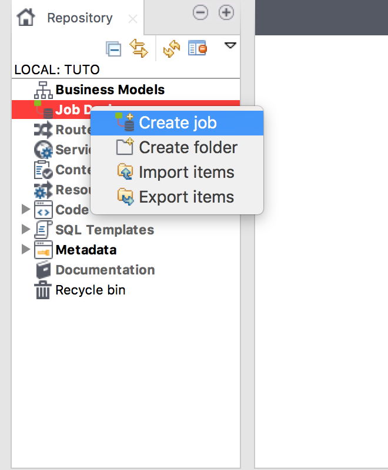
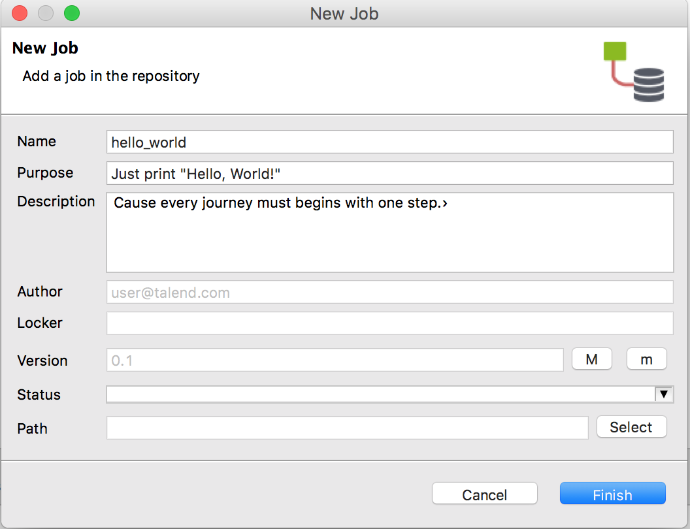
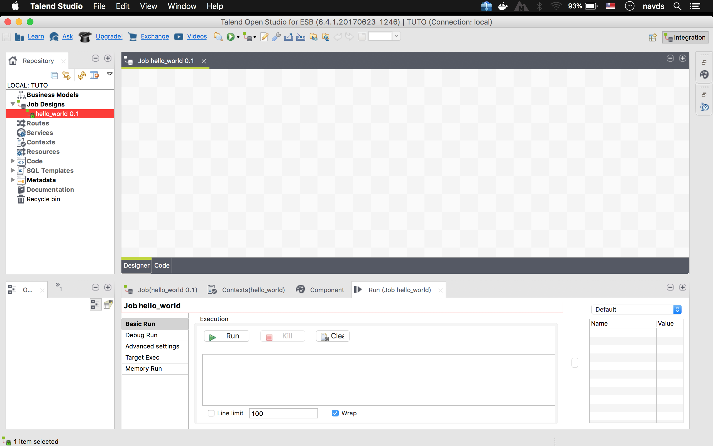
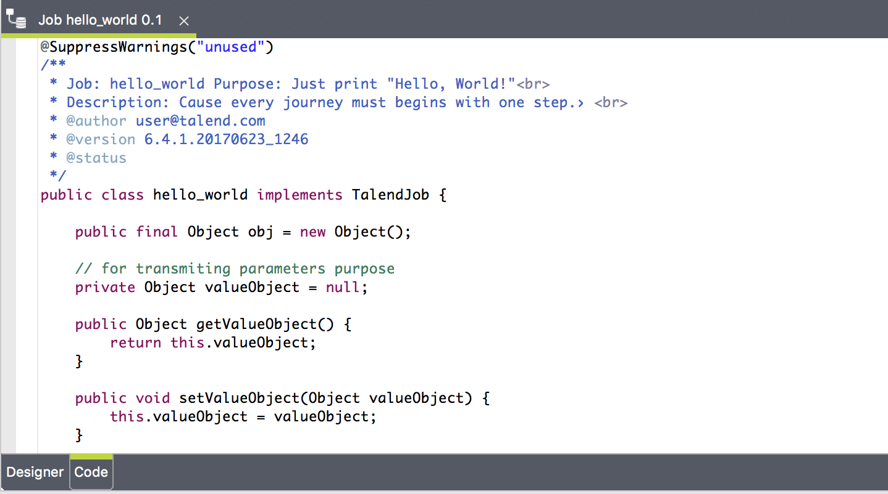
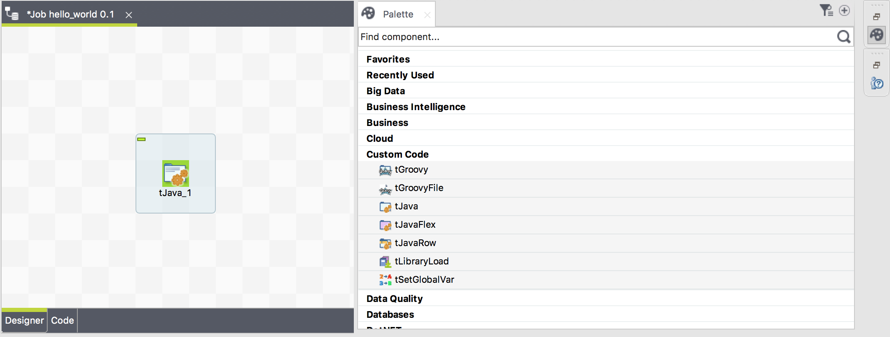
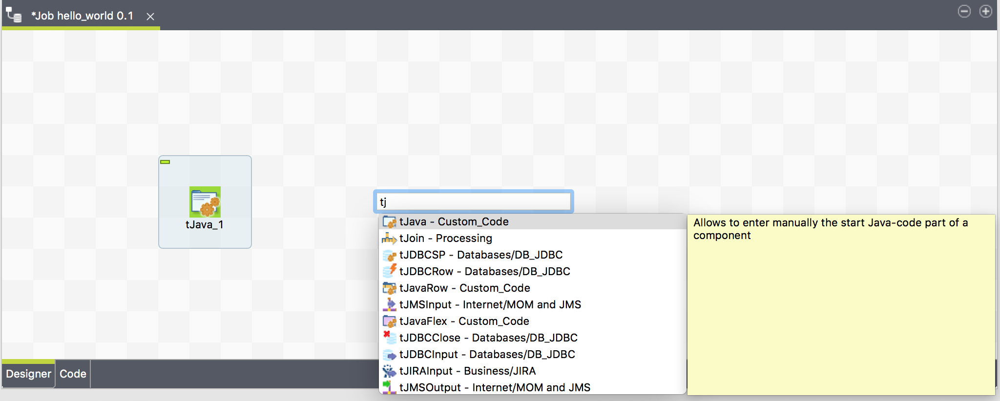
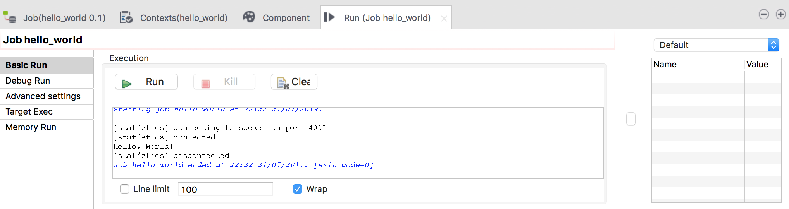
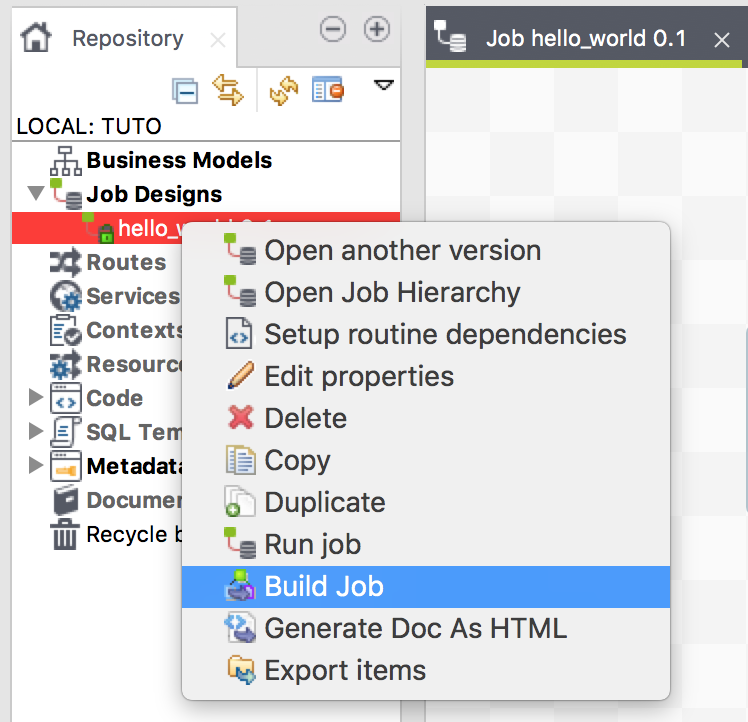
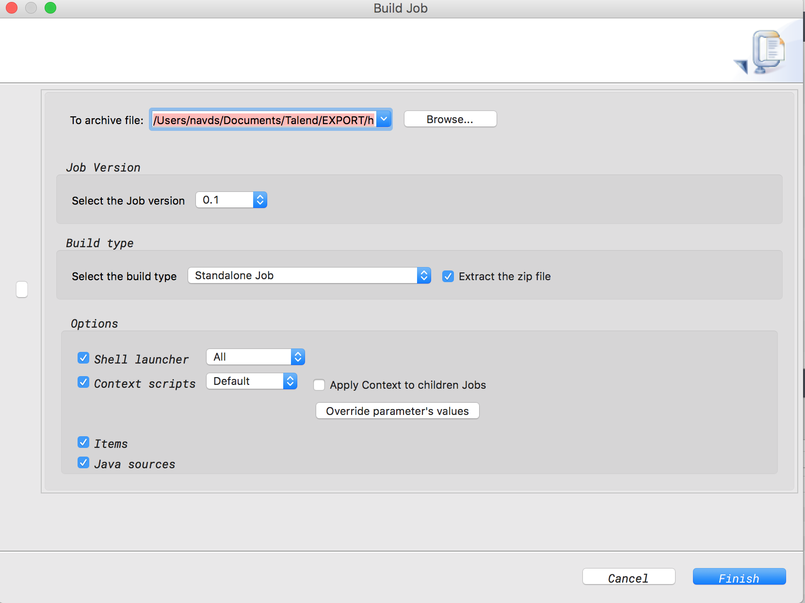
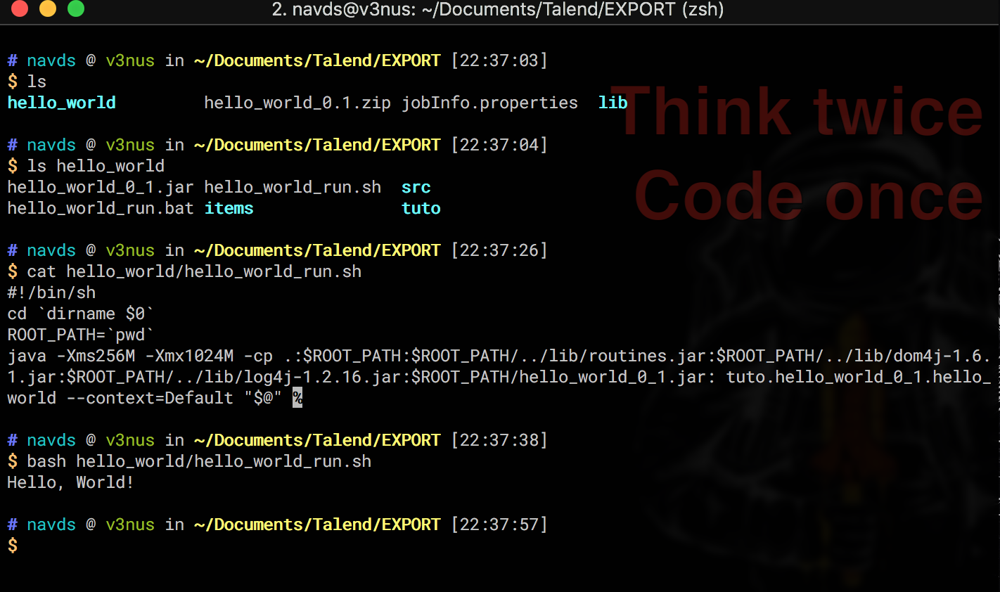

# Développement de job standalone

## Hello, world

Je vous suspecte d'avoir déjà à ce stade une notion de Talend. Quoique, commençons par le traditionnel *Hello World*.

Creez un projet **TUTO** si vous ne l'aviez pas encore fait dans le module precedent (ta main, Ducobu!).

Dans la vue *Repository* qui se trouve par defaut à gauche, créez un job "hello_world".



Remplir comme suit:


Le tableau de design (l'espace en carreaux d'echec) ne contient aucun element jusque là:


Mais si vous cliquez sur l'onglet **Code** en bas du plateau d'echec, vous verez que des codes sont déjà autogénérés.



Ajoutons une pièce du puzzle, je veux dire un composant. Clique sur l'icône palette à droite et y cherchez le composant nommé **tJava** et faire un drag-and-drop pour le placer dans le design.



et bamm!! (pourquoi ils disent toujours çà dans les tuto déjà ?). Vous pouvez également cliquez sur le plateau d'échec et commencer à écrire le nom du composant pour avoir une suggestion.



Maintenant cliquer sur la vue **Component** en bas, *tJava_1* étant sélectionné, et y écrire:

```java
System.out.println("Hello, World!");
```

Cliquer sur **Run** et bamm!! (sérieusement, arrêtez-moi!)



C'est bien tout çà mais que faire si l'on veut executer le job sur un serveur qui n'a pas le Studio ? Il suffit d'avoir un JRE (8 est recommandé en passant), compiler et exporter le job comme suit:




Naviguez sur le repertoire que vous avez choisi pour l'export, si vous avez oublié de cocher "extract zip", il faut le faire manuellement. Un job compilé par talend n'est autre qu'une suite de jar, de fichiers de contexts, facultativement des métadonnées, et des scripts shell pour faciliter l'appel.
Moi, sous *nix, utilise bash:


<p align="center">
  
</p>
