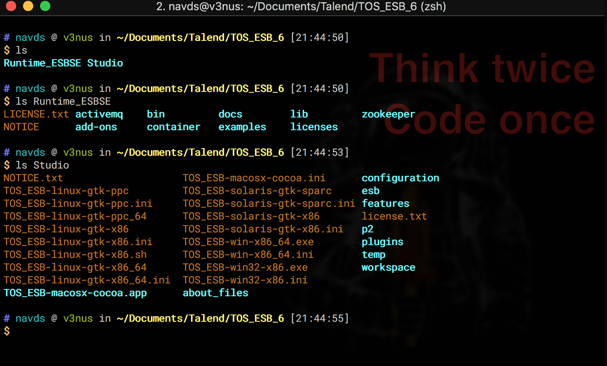
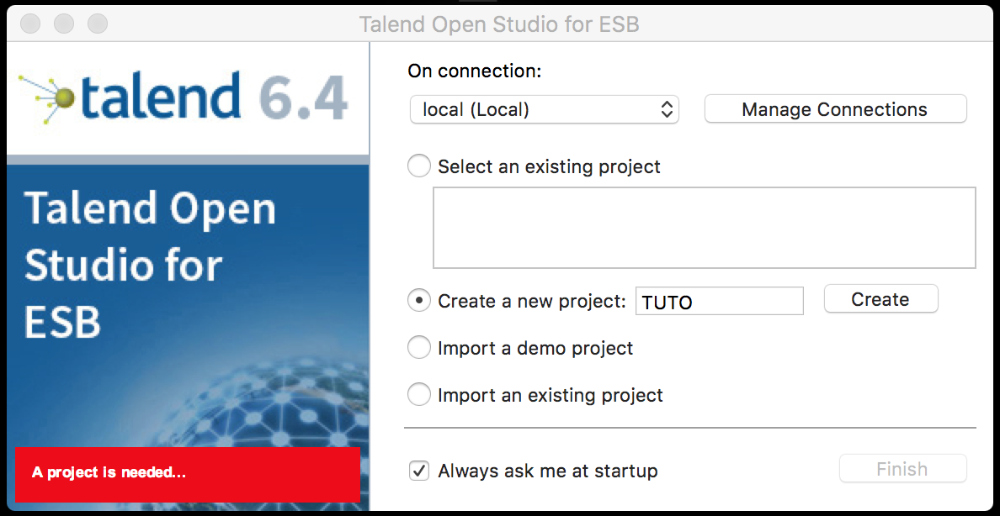
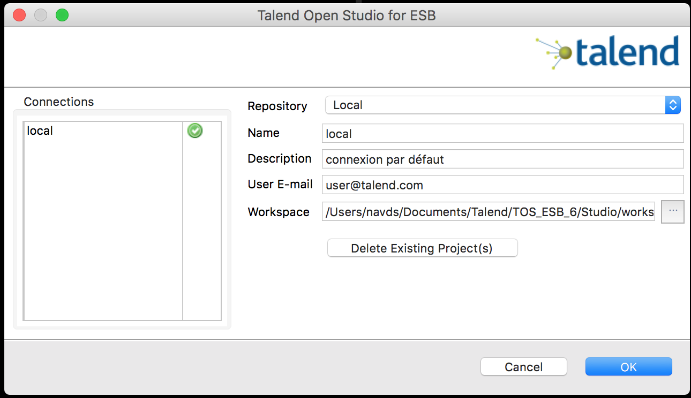
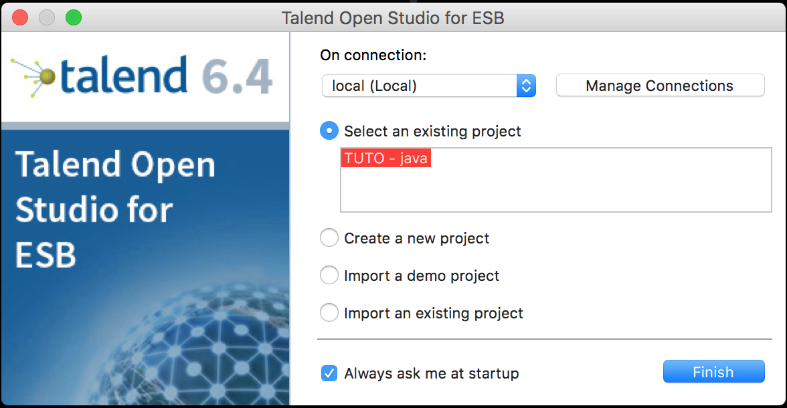
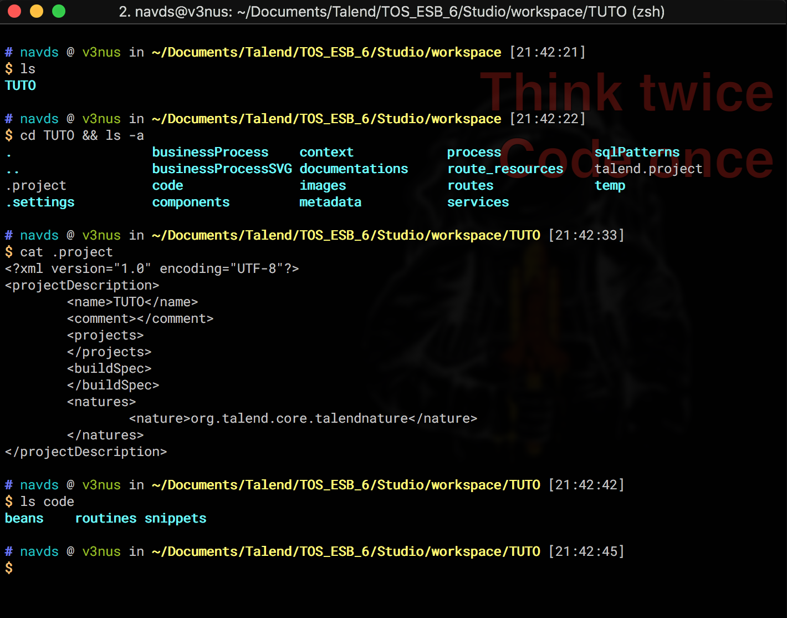
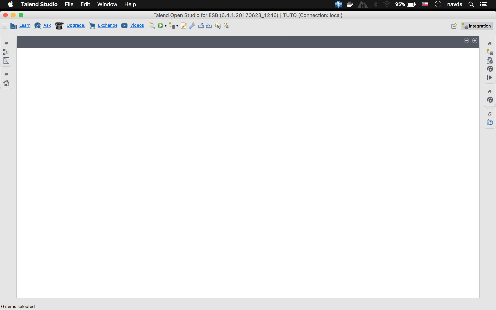
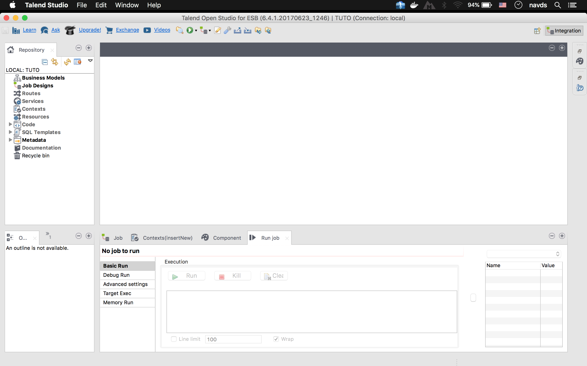

# Préparation et installation

Dans la suite, nous utiliserons Talend Open Studio for ESB qui est multiplateforme: mon equipe est sous Windows, personnellement je travaille sur Linux, et j'ecris ce tutoriel sur Mac.

1. [Telecharger l'application sur le site officiel](https://www.talend.com/products/application-integration/esb-open-studio/). Actuellement, la version 7.2 est disponible mais j'utilise encore 6.4.1 pour ce tuto.
2. [Telecharger les manuels](https://www.talend.com/products/application-integration/esb-manuals-release-notes/#product_user_manuals_pdf) et lisez diagonalement **TalendOpenStudio_ESB_GettingStarted_FR_7.2.1.pdf**
3. Suivez l'instruction dans le guide d'installation (TalendOpenStudio_ESB_IG_<Windows|Mac|Linux>_FR_7.2.1.pdf) si besoin pour installer.

Vous devriez avoir la structure de dossier suivante. Le dossier *Runtime_ESBSE* contient les composants serveurs notamment le container Karaf et ActiveMQ, il n'est pas necessaire si vous ne developpez pas des OSGi. Toutefois, veuillez vous assurez qu'ils marchent. Karaf ecoute par defaut sur 8040 et ActiveMQ sur 8161. Le dossier *Studio* est l'emplacement d'installation de l'IDE Talend (que nous appelons "Studio").

Une fois lancé, il va vous demander de creer un projet:

Notez que vous pouvez changer l'espace de travail en cliquant sur **Manage Connections** pour obtenir cette fenetre:

Finaliser la creation du nouveau projet et l'ouvrir:

Mais avant de se perdre dans l'interface, voyons la structure de cette espace de travail:

A la premiere ouverture, une sous-fenêtre va s’ouvrir demandant si vous voulez connecter le Studio avec Talend Community, ignorez la, elle ne fait rien du tout pour vous donner la peine.

Maintenant, selon votre système d’exploitation, vous aurez quelque chose comme ceci:

ou en reorganisant

  

  
</p
